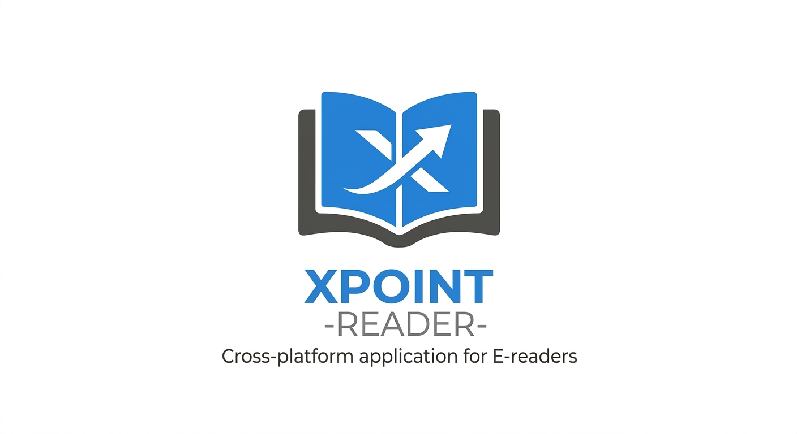
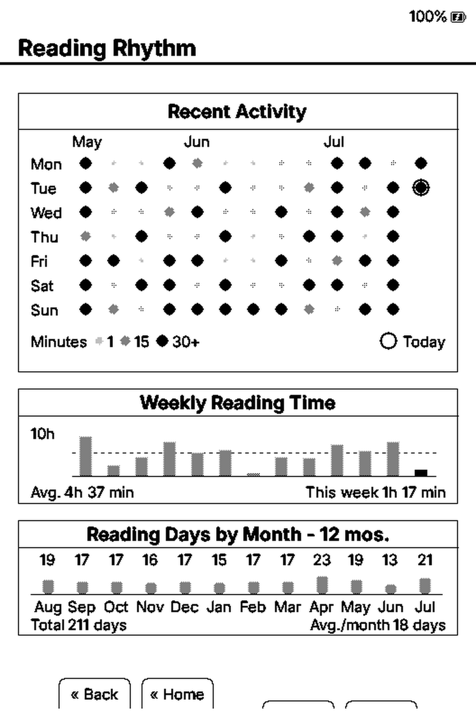
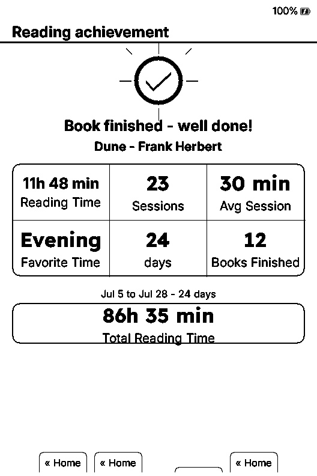
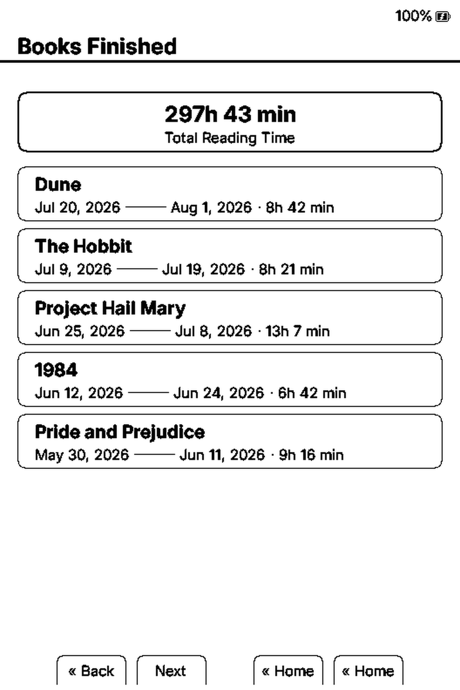

# XPoint



**XPoint** is open-source e-reader firmware for ESP32-based devices — community-built,
fully hackable, free forever. It is a fork of
[crosspoint-reader/crosspoint-reader](https://github.com/crosspoint-reader/crosspoint-reader)
with a focus on the reading experience of the Xteink X4 Pro, plus features the
upstream project may never take. It is provided as-is, with no warranty.

> **Coming from official CrossPoint?** Existing devices follow OTA redirects transparently
> — no manual re-flash is needed. OTA updates in this fork are delivered from this
> repository's own GitHub releases and verified against an Ed25519 signature shipped with
> the fork — see [OTA signing](docs/OTA_SIGNING.md).

| Device family | SoC | Supported |
|---|---|---|
| Xteink X4, Xteink X3 | ESP32-C3 | ✅ |
| Xteink X4 Pro, Seeed reTerminal Sticky, M5PaperMono | ESP32-S3 | ✅ |

Check the [devices page](https://crosspointreader.com/devices) for the full list.

---

## ✨ Feature guide

### 📖 Reading experience

- **Reader engine**: EPUB 2/3 rendering with embedded-style option, image handling,
  hyphenation, kerning, adaptive table layouts, native CJK ruby annotations, chapter
  navigation, footnotes, bookmarks, go-to-percent, auto page turn, orientation control,
  focus reading, and more.
- **Dictionary on long-press or touch.** Long-press a word (or tap it on touch devices)
  to get the definition via [StarDict](docs/dictionary.md). No menu detour. The
  long-press action is configurable (dictionary, footnote, …).
- **Time left in the current chapter.** A live "47 min left" estimate in the status bar,
  computed from your real reading speed (220 wpm baseline, 15-sample trimmed mean,
  80–900 wpm clamps — Kindle's algorithm). Show it left, right, or hide it.
- **Formats**: native handling for `.epub`, `.xtc/.xtch`, `.txt`, and `.bmp`.
- **Tilt page turn** (X3 and Sticky).
- **Custom fonts**: install your favorite fonts on the SD card — see
  [Custom SD-card fonts](#custom-sd-card-fonts).

### 📊 Reading statistics

A complete reading-statistics subsystem with a CrossInk-style card UI — full credit to
[@uxjulia](https://github.com/uxjulia)
([CrossInk](https://github.com/uxjulia/CrossInk)) for the original `BookStatsView`
design, and to [@Sichroteph](https://github.com/Sichroteph)
([YACP](https://github.com/Sichroteph/YACP)) for the Reading Rhythm, Reading
Achievement, and Finished Books screens and the screenshots above, which this fork
ports directly.

| | |
|---|---|
| <br>**Reading Stats** — per-book summary and this-device totals on one screen | <br>**Reading Rhythm** — daily intensity over the last 12 months, weekly reading time, reading days, current and best streaks |
| <br>**Reading Achievement** — celebration screen when you finish a book | <br>**Finished Books** — month-by-month history of completed books with dates and reading time |

- **Per-book and global stats**: sessions, reading time, pages turned, progress,
  reading speed (WPM), average session, reading streak, books read.
- **Reading speed (WPM)**: Kindle-style trimmed-mean tracker — 15-sample window,
  the two fastest and two slowest samples dropped, 80–900 wpm clamps.
- **Average session**: a 10-sample trimmed-mean session window, so one marathon
  (or an aborted glance) doesn't skew your average.
- **Reading Rhythm**: real minutes-per-day history (91 days) driving a daily
  intensity grid, weekly reading-time bars, and a 12-month reading-days chart.
- **Finished Books**: a bounded 32-book index on the SD card, grouped by finish
  month. Completed entries recover from your recent-books list — no SD scan.
- **Reading Achievement**: finishing a new book opens a celebration screen with
  the book's reading time, sessions, favorite reading period, and your device
  totals.
- **Edit dates**: fix a book's start/finish dates (and its completed state)
  directly from its stats screen.
- **End-of-book flow**: crossing the real end of a book completes it automatically;
  leaving while on the final page (or at ~100%) asks "Mark as Finished?" once —
  a decline is remembered until you read further, so a jump or trailing material
  never silently finishes a book.

### 🏠 Home & library

- **Progress on every home card.** "42% • 2h 30m" right under each book in
  *Recent books*, so you can pick up where you left off without opening it.
  Same Kindle-WPM engine as the chapter timer.
- **Library workflow**: folder browser, hidden-file toggle, long-press delete,
  recent books, SD-cache management.

### 📡 Wireless

- File transfer web UI and WebSocket fast uploads
- EPUB Optimizer
- Web settings UI/API (edit many device settings from the browser)
- WebDAV handler
- AP mode (hotspot) and STA mode (join existing Wi-Fi), both with QR helpers
- Calibre wireless connect flow
- OPDS browser with saved servers (up to 8), search, pagination, and direct download
- OTA update checks and installs from GitHub releases
- KOReader progress sync

### ⚙️ Customization & hardware

- **Frontlight side-swipe gestures** (frontlight-equipped devices only): while reading,
  swipe vertically on the screen edges to control the frontlight — left edge adjusts
  color temperature (up = warmer, down = cooler), right edge adjusts brightness
  (up = brighter, down = dimmer). Sliding all the way down on the right edge turns the
  light off. Works independently of the "Touch Reader Controls" setting and can be
  toggled in *Settings → Display → Frontlight Side Gestures*.
- **Configurable Home button.** Short-press, double-click, and long-press are three
  independent bindings, each remappable in *Settings → Controls*.
- **Power button: short press sleeps, long press shuts down.** 400 ms hold = proper
  shutdown with cover screen + rail cut. Short press keeps its own binding and
  defaults to Sleep.
- **Auto power off.** After a configurable idle (default 4 h, range 2–12 h, "12 h" =
  Off) the device wakes on the RTC, paints a shutdown screen, and cuts the peripheral
  rail instead of draining in deep sleep. Next power press is a cold boot.
- **Customization**: night mode, multiple themes (Classic, Lyra, Lyra Extended,
  RoundedRaff), sleep screen modes including transparent overlays, front/side button
  remapping, status bar controls, refresh cadence, and more.
- **Localization**: 34 UI languages and counting, including CJK font fallback and
  RTL support.
- **Screenshots** and **tilt page turn** (X3 and Sticky).
- **USB Drive mode (X4 Pro)**: access the SD card as USB mass storage.

### 💾 Gentle on your SD card

**Smart progress saving — writes only when something changed.** Stock CrossPoint
writes your reading position to the SD card on *every single page turn*. XPoint
keeps your place in memory and persists it every two minutes only if you actually
moved — and always the instant you close the book, sleep, power off, or reach the
end of a book. The result: up to **20× fewer SD writes** during a reading session,
less card wear, and no page-turn lag — with at most 2 minutes of progress ever at
risk, and a low-battery mode that switches back to save-on-every-turn when it
matters most.

### 🔒 Signed OTA updates

Every release ships a `manifest.json` + Ed25519 signature. The device verifies against
a key baked into the firmware before flashing; corrupted or tampered updates are
rejected. Manual flashing still works. See [OTA signing](docs/OTA_SIGNING.md).

### 🔜 Coming soon

More themes. Web plugins. Bluetooth pageturner. Much more — stay tuned.

---

## USB-locked devices (Xteink Unlocker)

Some Xteink units purchased from third-party stores (e.g. AliExpress) ship with USB
flashing locked from the factory. If your device is locked, you will need to use the
**Xteink Unlocker** tool available at https://crosspointreader.com/#unlock-tool before
you can flash CrossPoint.

**You do not need this tool if you bought your device directly from xteink.com.** Those
units are not locked.

**Not sure if your device is locked?** Power it on, connect the USB-C cable, and try
flashing via the web flasher first (see [Install firmware](#install-firmware) below). If
the browser's serial device picker does not show your device, try a different USB port
or browser before assuming the device is locked. Only reach for the unlocker if the
device still doesn't appear.

> ### ⚠️ WARNING: READ THIS BEFORE USING THE UNLOCKER ⚠️
>
> **The only officially supported firmwares in the unlock tool are CrossPoint and
> CrossInk.**
>
> Flashing any other firmware on a USB-locked device may **permanently brick the
> device** or leave it **permanently stuck on that firmware with no recovery path**.
> Once USB flashing is re-locked, your only way back is via OTA, and if the firmware
> you flashed doesn't support OTA, **there is no way out**.

---

## Install firmware

### Web installer (recommended)

1. Connect your device to your computer via USB-C and wake/unlock the device
2. Go to https://crosspointreader.com/#flash-tools, select your device (X3, X4,
   Xteink X4Pro, Seeed reTerminal Sticky, or M5PaperMono), and choose an official
   CrossPoint release.

### Web installer (specific version)

1. Connect your device to your computer via USB-C and wake/unlock the device
2. Download the firmware file for your device from
   [Releases](https://github.com/Belphemur/XPoint/releases), or compile yourself.
3. Go to https://crosspointreader.com/#flash-tools, select your device, click
   "Custom .bin" and upload the firmware file.

### Revert to Official Firmware

To revert to the official firmware, you can also flash the latest official firmware
using https://crosspointreader.com/#flash-tools.

### Command line

1. Install [`esptool`](https://github.com/espressif/esptool):

```bash
pip install esptool
```

2. Download the firmware file for your device from the
   [releases page](https://github.com/Belphemur/XPoint/releases).
3. Connect your device via USB-C.
4. Find the device port. On Linux, run `dmesg` after connecting. On macOS:

```bash
log stream --predicate 'subsystem == "com.apple.iokit"' --info
```

5. Flash an X3 or X4:

```bash
esptool.py --chip esp32c3 --port /dev/ttyACM0 --baud 921600 write_flash 0x10000 /path/to/firmware.bin
```

   Flash an Xteink X4Pro, Seeed reTerminal Sticky, or M5PaperMono:

```bash
esptool.py --chip esp32s3 --port /dev/ttyACM0 --baud 921600 write_flash 0x10000 /path/to/firmware.bin
```

### Manual

See [Development quick start](#development-quick-start) below.

---

## Custom SD-card fonts

Convert your own TTF/OTF files into `.cpfont` files that load from the SD card. No
firmware reflash is needed.

1. Go to https://crosspointreader.com/fonts and open the "SD-card font builder" form.
2. Upload up to four styles (regular, bold, italic, bold-italic), set the family name,
   point sizes, and Unicode range.
3. Download the generated `.cpfont` files.
4. Copy them to your SD card under `/fonts/YourFont/` (or `/.fonts/YourFont/` to hide
   the folder).
5. Select the font on the device from the font settings.

Conversion runs the firmware repo's `lib/EpdFont/scripts/fontconvert_sdcard.py` script
unmodified, so output matches a local host build.

---

## Documentation

- [User Guide](./USER_GUIDE.md)
- [Web server usage](./docs/webserver.md)
- [Web server endpoints](./docs/webserver-endpoints.md)
- [Project scope](./SCOPE.md)
- [Contributing docs](./docs/contributing/README.md)
- [Touch and UI development](./docs/contributing/touch-and-ui.md) — how to build new
  screens on the FreeInkUI activity bases (UiListActivity and friends), plus build envs
  for the non-Xteink touch devices

---

## Development quick start

### Prerequisites

- [pioarduino PlatformIO Core](https://github.com/pioarduino/platformio-core) or
  [VS Code + pioarduino IDE](https://github.com/pioarduino/pioarduino-vscode-ide)
- Python 3.8+
- `clang-format` 21
- USB-C cable supporting data transfer

### Setup

```bash
git clone --recursive https://github.com/Belphemur/XPoint
cd XPoint

# if cloned without --recursive:
git submodule update --init --recursive
```

### Nix/NixOS

Nix/NixOS users can enter the development shell with either `nix develop` (flakes) or
`nix-shell`:

```bash
nix develop -f nix
# or
nix-shell nix
```

To flash a connected ESP32-C3 device, enable PlatformIO's udev rules in your NixOS
configuration:

```nix
services.udev.packages = with pkgs; [ platformio-core.udev ];
```

After rebuilding the system configuration, reconnect the device or reload udev rules.

### Build / flash / monitor

```bash
pio run --target upload
```

### Contributor pre-PR checks

```bash
./bin/clang-format-fix
pio check -e default
pio run -e default
```

### Debugging

After flashing the new features, it's recommended to capture detailed logs from the
serial port.

First, make sure all required Python packages are installed:

```python
python3 -m pip install pyserial colorama matplotlib
```

After that run the script:

```sh
# For Linux
# This was tested on Debian and should work on most Linux systems.
python3 scripts/debugging_monitor.py

# For macOS
python3 scripts/debugging_monitor.py /dev/cu.usbmodem2101
```

Minor adjustments may be required for Windows.

---

## Internals

CrossPoint Reader is pretty aggressive about caching data down to the SD card to
minimise RAM usage. The ESP32-C3 only has ~380KB of usable RAM, so we have to be
careful. A lot of the decisions made in the design of the firmware were based on this
constraint.

### Data caching

The first time chapters of a book are loaded, they are cached to the SD card.
Subsequent loads are served from the cache. This cache directory exists at
`.crosspoint` on the SD card. The structure is as follows:

```text
.crosspoint/
├── epub_<hash>/         # one directory per book, named by content hash
│   ├── progress.bin     # reading position (chapter, page, etc.)
│   ├── cover.bmp        # generated cover image
│   ├── book.bin         # metadata: title, author, spine, TOC
│   ├── css_rules.cache  # parsed CSS rule cache
│   ├── img_*            # rendered image cache files
│   ├── stats_v8.bin     # per-book reading statistics
│   └── sections/        # per-chapter layout cache
│       ├── 0.bin
│       ├── 1.bin
│       └── ...
├── settings.json        # device settings
├── state.json           # resume/runtime state
├── recent.json          # recent books list
├── global_stats.bin     # all-books reading statistics (407-byte versioned record)
└── finished_books.bin   # index of completed books (32 entries)
```

Removing `/.crosspoint` clears all cached metadata and forces a full regeneration on
next open. Book deletes, overwrites, and moves done through the firmware or web UI
clear or re-key matching caches; manual SD-card edits may leave stale cache directories
behind.

For more details on the internal file structures, see the
[file formats document](./docs/file-formats.md).

---

## Contributing

Contributions are welcome. If you're new to the codebase, start with the
[contributing docs](./docs/contributing/README.md). For things to work on, check the
[ideas discussion board](https://github.com/crosspoint-reader/crosspoint-reader/discussions/categories/ideas)
— leave a comment before starting so we don't duplicate effort.

Everyone here is a volunteer, so please be respectful and patient. For governance and
community expectations, see [GOVERNANCE.md](./GOVERNANCE.md).

---

## Support CrossPoint

[](https://app.royalty.dev/crosspoint-reader/crosspoint-reader)

XPoint exists thanks to the CrossPoint team and its community. If this firmware is
useful to you, please **support the original CrossPoint project** — they build and
maintain the foundation this fork stands on.

If you're planning to buy an Xteink device, consider purchasing an **X3/X4 Developer
Edition** through https://crosspointreader.com. CrossPoint receives a small share of
each sale, helping fund development costs.

---

CrossPoint Reader and XPoint are **not affiliated with Xteink or any device
manufacturer**.