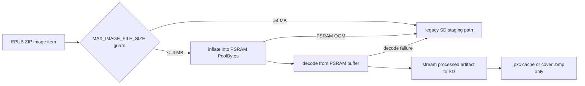
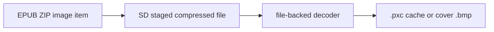

# Design: PSRAM image staging

## Context

On PSRAM-capable boards (`BOARD_HAS_PSRAM`, X4 Pro / S3 builds), chapter images and covers currently
touch the SD card twice in compressed form before the e-ink render:

1. The EPUB parser stages the compressed image file to SD.
2. The render path reads that staged file back into a software decoder, then writes the fully
   processed `.pxc` pixel-cache or cover `.bmp` artifact to SD.

On the ESP32-C3 (`default` env) this streaming path is the right fit: DRAM is tight, but the SD card
is the cheapest scratch space. On PSRAM boards it is unnecessary SD wear and latency. This design
moves compressed-image staging and decode input to PSRAM while keeping the C3 path byte-for-byte
unchanged.

## Current flow

| Step | Location | Behavior |
|---|---|---|
| Build-time image discovery | `lib/Epub/Epub/parsers/ChapterHtmlSlimParser.cpp:942-1011` | Resolves each `` href, header-probes dimensions via `ImageDimsProbe`, and assigns the SD staging name `imageBasePath + imageCounter + ext`. If the header probe fails, it falls back to a full SD extraction (`ChapterHtmlSlimParser.cpp:970-990`) and probes the staged file. |
| Build-time render | `lib/Epub/Epub/parsers/ChapterHtmlSlimParser.cpp:1149-1162` | Creates an `ImageBlock` carrying both the staging `imagePath` and the ZIP-local `srcPath`. |
| Runtime cache miss | `lib/Epub/Epub/blocks/ImageBlock.cpp:318-422` | If no valid `.pxc` cache exists, lazily extracts `srcPath` to `imagePath` on SD (`ImageBlock.cpp:357-366`), then opens that file and passes its path to the decoder. |
| Extraction | `lib/Epub/Epub.cpp:970-984` | `extractItemToFile()` streams ZIP content into an SD `HalFile`. |
| JPEG decode | `lib/Epub/Epub/converters/JpegToFramebufferConverter.cpp:55-90,408-432` | Opens the staged SD file with JPEGDEC file callbacks (`jpegOpen/jpegRead/jpegSeek` over `HalFile`), decodes to framebuffer, and streams 2bpp rows into the `.pxc` cache. |
| PNG decode | `lib/Epub/Epub/converters/PngToFramebufferConverter.cpp:57-90,322-350` | Same shape with PNGdec file callbacks. |
| Cache band buffer | `lib/Epub/Epub/converters/PixelCache.h:91-116` | Allocates directly with `heap_caps_malloc(MALLOC_CAP_SPIRAM)` on PSRAM builds and `heap_caps_free` in the destructor, bypassing the project's `poolMalloc`/`PoolBytes` allocator boundary. |
| Cover BMP | `lib/Epub/Epub.cpp:727-800` | Writes `.cover.jpg` / `.cover.png` to SD, reads it back into `JpegToBmpConverter::jpegFileToBmpStream` / `PngToBmpConverter::pngFileToBmpStream`, then deletes the temp and keeps only the final `.bmp`. |

## Target flow

### PSRAM build (x4pro and other `BOARD_HAS_PSRAM` boards)

- No compressed image bytes are written to SD at any point, even as a persistent cache.
- The compressed image is re-extracted from the ZIP on demand, matching the existing PSRAM HTML
  chapter path (`lib/Epub/Epub.cpp:941-965`).
- Decode input is the PSRAM buffer; all compressed-image I/O is eliminated.
- Only the fully processed artifact — `.pxc` cache or cover `.bmp` — is written to SD.
- On PSRAM allocation failure, oversized image, or decode failure, the exact legacy SD path is used
  as a functional fallback.

### ESP32-C3 build (default)

The C3 path keeps its current behavior unchanged. `#ifdef BOARD_HAS_PSRAM` selects between paths,
not between allocators: any allocation call site still goes through `poolMalloc` / `PoolBytes`.

## Confirmed decisions

| # | Decision | Rationale |
|---|---|---|
| 1 | Scope includes both the chapter-image pipeline and cover BMP generation | Both are compressed-image staging hot spots; fixing only one leaves SD wear and latency on the other. |
| 2 | PSRAM builds never write compressed image bytes to SD, even as a persistent cache | PSRAM is large enough to re-extract on demand; a persistent compressed cache buys nothing after decode. |
| 3 | A single compressed image larger than 4 MB is rejected before PSRAM allocation | Enforces the CWE-400 oversized-decompression rule. Larger images still render via the legacy SD fallback. |
| 4 | PSRAM allocation failure or oversized image falls back to the existing SD temp-file path | No functional regression: the image still renders. |

## Constants

| Constant | Value | Purpose |
|---|---|---|
| `MAX_IMAGE_FILE_SIZE` | 4 MB (4 × 1024 × 1024 bytes) | Pre-allocation guard for a single compressed image on PSRAM builds. Larger images take the SD fallback. |
| `PixelCache::MAX_BAND_BYTES` | 24 KB (existing) | Decode band working-set ceiling; unchanged, but the buffer allocation is refactored to `poolMalloc`. |
| `PixelCache::MIN_BAND_ROWS` | 16 rows | Minimum decode band height; unchanged. |

## Implementation notes

- A guarded `extractItemToPsram`-style helper on `Epub` will call `getItemSize()` first, reject any
  image above `MAX_IMAGE_FILE_SIZE`, then inflate into a `PoolBytes` buffer via the existing
  `readItemContentsToBytes` path.
- `JpegToFramebufferConverter` and `PngToFramebufferConverter` gain memory-backed open/read/seek
  callbacks alongside the existing file-backed ones, selected by a small source abstraction
  (path vs buffer+size) rather than a broad interface.
- `PixelCache` band-buffer allocation moves from direct `heap_caps_malloc` / `heap_caps_free` to
  `poolMalloc` / `poolFree` (or `PoolBytes`) while retaining the same 24 KB band ceiling.
- `ImageDimsProbe` can be fed straight from the PSRAM buffer for dimension probing.
- `generateCoverBmp()` on PSRAM builds inflates the cover image into PSRAM and feeds
  `JpegToBmpConverter` / `PngToBmpConverter` from memory; only the final `.bmp` reaches SD.
- Host tests cover the size-guard logic and, where host-testable, the decoder memory-input seam.

## Decision log

| Date | Decision | Reason |
|---|---|---|
| 2026-09-13 | Adopt PSRAM staging for both chapter images and cover BMP, with SD fallback | User-confirmed design; balances SD wear/latency savings against functional risk. |
| 2026-09-13 | Enforce a 4 MB `MAX_IMAGE_FILE_SIZE` guard before PSRAM allocation | CWE-400 oversized-decompression protection; >4 MB images use the existing SD path. |
| 2026-09-13 | Keep C3 (`default`) path byte-for-byte unchanged | The PSRAM optimization is board-conditional; C3 hardware has no PSRAM to benefit. |
